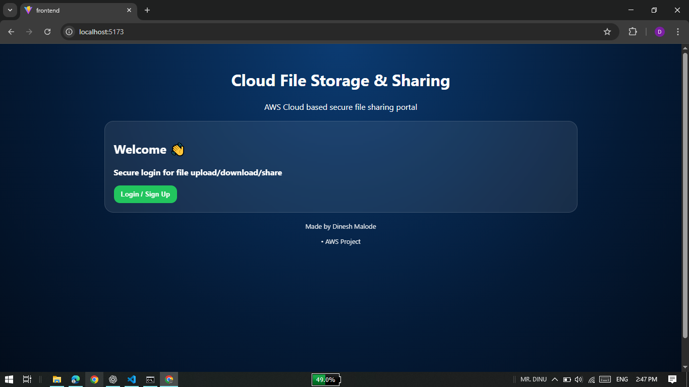
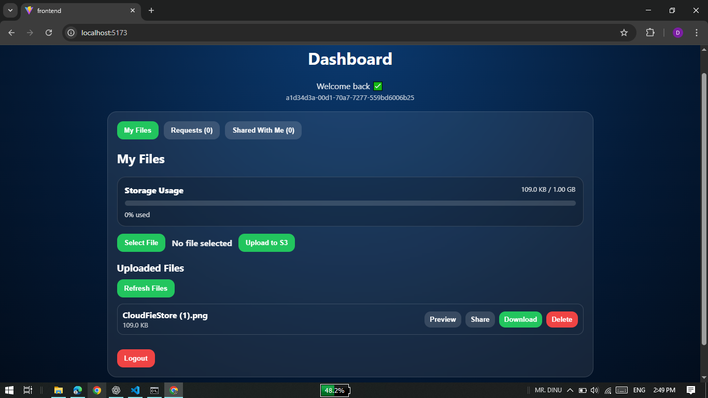
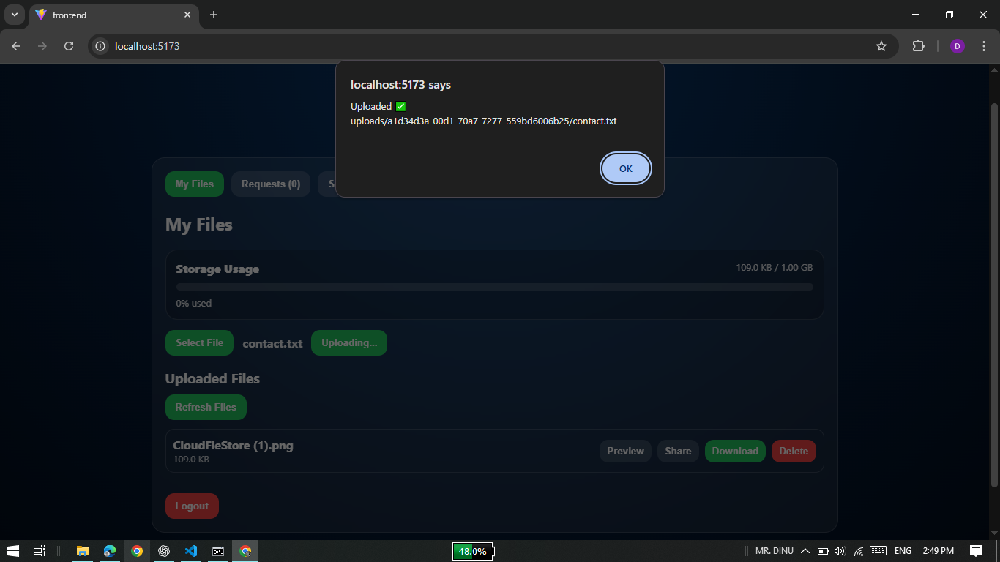
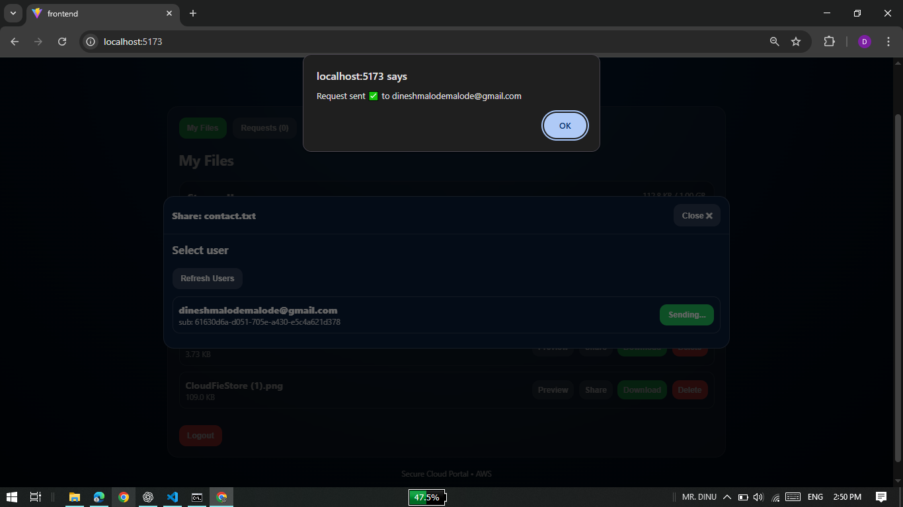
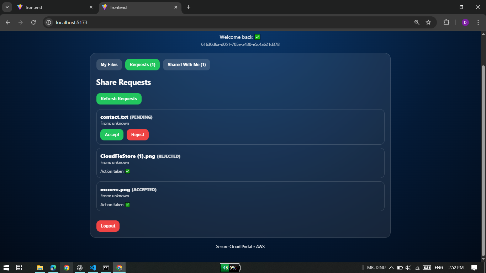

# ☁️ Cloud File Storage & Sharing Application

A secure cloud-based file storage and sharing web application built using **React** and **AWS Cloud Services**.

This project allows users to authenticate securely, upload files to cloud storage, share files with other users, and manage access requests — all through a modern web dashboard.

---

## 🚀 Live Demo
👉 https://file-sharing-app-with-aws-cloud.vercel.app/

---

## 📸 Application Screenshots

### 🔐 Login Page

### 📊 Dashboard

### 📁 File Upload & List

### 🤝 Sharing Requests

### 🤝 Incoming Requests

---

## ✨ Features

- Secure user authentication using AWS Cognito  
- Upload, download, preview, and delete files  
- Cloud storage using AWS S3  
- Share files with other registered users  
- Accept / reject file sharing requests  
- Dashboard showing storage usage  
- Real-time file listing  
- Responsive UI built with React  
- Fully deployed frontend and backend  

---

## 🛠 Tech Stack

### Frontend
- React + Vite  
- JavaScript  
- AWS Amplify SDK  

### Backend / Cloud
- AWS Cognito (Authentication)  
- AWS S3 (File Storage)  
- DynamoDB (Users & Share Requests)  
- AWS Lambda (Backend APIs)  
- AWS API Gateway  
- AWS Identity Pool  

### Deployment
- Vercel (Frontend Hosting)

---

## 🏗 Architecture Overview

## Author
- Dinesh Malode
- Aspiring AWS / DevOps Engineer & Learning Cloud

